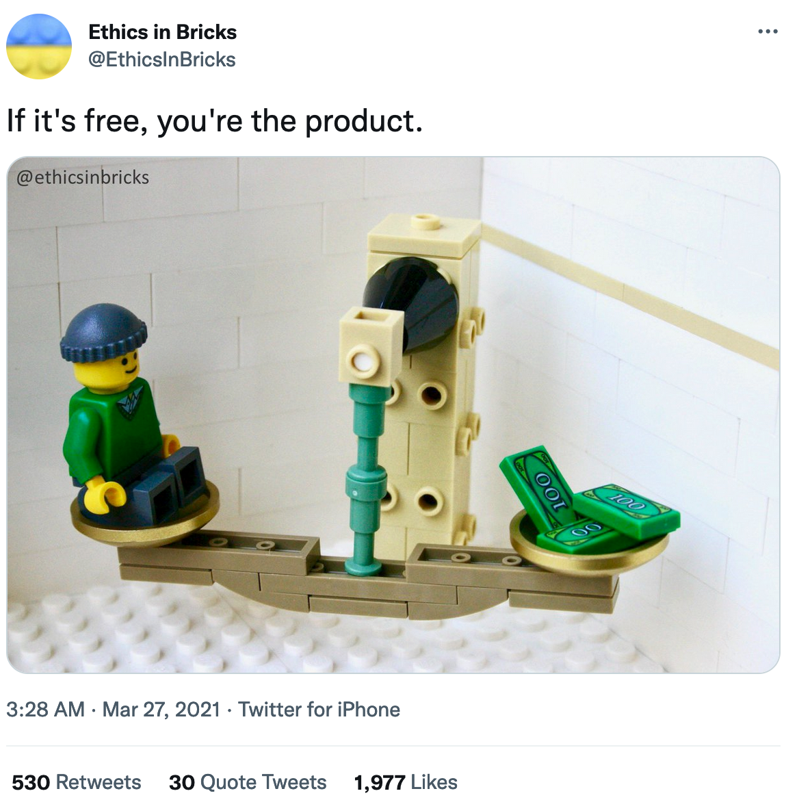

```{r setup, include=FALSE}
usethis::use_git_ignore(c("*.csv", "*.rds"))
options(htmltools.dir.version = FALSE)

library(knitr)
library(tidyverse)
library(xaringan)
library(fontawesome)
```

class: inverse, center, middle

# `r fa("far fa-images", fill = "#fff")`

**View the slides:** 

[bretsw.com/eme6356-fs22-module6](https://bretsw.com/eme6356-fs22-module6)

---

# `r fa("far fa-newspaper", fill = "#fff")` Data Stories

```{r, out.width = "640px", echo = FALSE, fig.align = "center"}

```

"If you previously didn't care about read time or # of visits to the assignment, the availability of tracking for those metrics nudges you to start caring" 

(Tweet from [@sarahesilverman](https://twitter.com/sarahesilverman/status/1496107638936985603))

---

# `r fa("far fa-newspaper", fill = "#fff")` Data Stories

```{r, out.width = "420px", echo = FALSE, fig.align = "center"}

```

"If it's free, you're the product." 

(Tweet from [@EthicsInBricks](https://twitter.com/EthicsInBricks/status/1375711433862877187))

---

class: inverse, center, middle

# `r fa("thumbs-up", fill = "#fff")` <br><br> Module 5 Discussion <br> Themes and Kudos

---

class: inverse, center, middle

# `r fa("fas fa-question", fill = "#fff")` <br><br> Module 5 Discussion <br> Final Thoughts?

---

class: inverse, center, middle

# `r fa("fas fa-calculator", fill = "#fff")` <br><br> Technoethics

---

# Is This Technology Ethical?

```{r, out.width = "100%", echo = FALSE, fig.align = "center"}
include_graphics("img/6-technology-ethical.png")
```

<div class="caption">
<a href="https://technoethics.digciz.org/index.php/is-technology-ethical-analysis-helper/">Is This Technology Ethical? Analysis Helper for Educators</a>
</div>

Resource from [Autumm Caines](http://autummcaines.com/)

---

# CompelU

```{r, out.width = "100%", echo = FALSE, fig.align = "center"}
include_graphics("img/6-compelu.png")
```

<div class="caption">
<a href="https://compelu.com/">CompelU: We Watch We Care</a>
</div>

Resource from [Autumm Caines](http://autummcaines.com/)

---

# Civics of Technology

```{r, out.width = "100%", echo = FALSE, fig.align = "center"}
include_graphics("img/6-civics-of-technology.png")
```

<div class="caption">
<a href="https://www.civicsoftechnology.org/">Civics of Technology website</a>
</div>

Resource from [Dan Krutka](https://coe.unt.edu/people/daniel-g-krutka) and [Marie Heath](https://www.loyola.edu/school-education/faculty/marie-heath)

---

# AI Bill of Rights

```{r, out.width = "100%", echo = FALSE, fig.align = "center"}
include_graphics("img/6-ai-bill-of-rights.png")
```

<div class="caption">
<a href="https://www.whitehouse.gov/ostp/ai-bill-of-rights/">Blueprint for an AI Bill of Rights</a>
</div>

Resource from [U.S. White House Office of Science & Technology Policy](https://www.whitehouse.gov/ostp/)

---

class: inverse, center, middle

# `r fa("fas fa-pencil", fill = "#fff")` <br><br> MadLibs

---

# Black Mirror MadLibs

```{r, out.width = "100%", echo = FALSE, fig.align = "center"}
include_graphics("img/6-madlibs1.png")
```

<div class="caption">
<a href="https://bretsw.shinyapps.io/madlibs-play/">MadLibs Play</a>
</div>

---
# Black Mirror MadLibs

```{r, out.width = "100%", echo = FALSE, fig.align = "center"}
include_graphics("img/6-madlibs2.png")
```

<div class="caption">
<a href="https://bretsw.shinyapps.io/data-dystopia/">Dystopian Storytelling</a>
</div>

---

class: inverse, center, middle

# `r fa("fas fa-binoculars", fill = "#fff")` <br><br> Looking Ahead

---

# Semester schedule

```{r, out.width = "100%", echo = FALSE, fig.align = "center"}
include_graphics("img/across-time.jpg")
```

- **Module 6:** Ethics in Analytics
- **Module 7:** Future of Analytics
- **Module 8:** Case Discussions

---

# Major Assignments

```{r, out.width = "600px", echo = FALSE, fig.align = "center"}
include_graphics("img/build.jpg")
```

### Analytics Assignments

--

- Analytics Case Presentation (200 points; group project) - **due end of Module 7**

--

- Analytics Ethics Statement (100 points)

---

class: inverse, center, middle

# `r fa("fas fa-question", fill = "#fff")` <br><br> Questions

<hr>

**What questions can I answer for you now?**

**How can I support you this week?**

<hr>

`r fa("envelope", fill = "#fff")` [bret.staudtwillet@fsu.edu](mailto:bret.staudtwillet@fsu.edu) | `r fa("twitter", fill = "#fff")` [@bretsw](https://twitter.com/bretsw) | `r fa("globe", fill = "#fff")` [bretsw.com](https://bretsw.com) | `r fa("fab fa-github", fill = "#fff")` [GitHub](https://github.com/bretsw/)